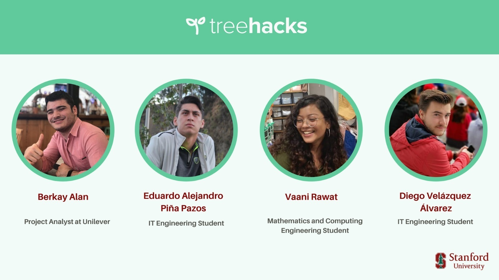

# Treehacks 2021 : Reform the Norm

## Stanford University Treehacks 2021

TreeHacks 2021 will be the 7th-ever iteration of TreeHacks. The theme this year is hacking for the future: addressing deeply impactful problems and building creative, unique solutions. It's identified five global and technological challenges that we think have tons of potential for innovation. Across each of these challenges, we’ve scaffolded resources like potential project ideas, data sets, APIs and toolkits, and more to help get you get started. 

## Our Main Idea

Today, we live in times of rapid social change while also having unparalleled access to information and its subsequent dissemination. However modern political interaction is characterized by strong partisanship and a general lack of interest in information sharing and agreement across party lines.

## Problems

**1) Data breach by social media giants leading to censorship and suppression of voices**

**2) Trauma survivors have difficulty navigating through triggering information**

**3) Creation of Echo-Chambers**

**4) No tangible Impact**

## Inspiration

We're living in times with unparalleled access to information and its subsequent dissemination, hence vastly increasing the potential for rapid social change.

However, modern political interaction is characterized by a general lack of interest in information sharing across varying viewpoints as well as the indulgence in performative allyship leading to no tangible impact. Additionally, social media is wildly notorious for its unethical use of data and algorithms to censor or suppress certain voices while promoting content which they can profit off of. Activism in countries witnessing a rise in polarised governments has also been met with strict action being taken against the ones who dare question the status quo.

With Reform the Norm we advocate to break the norm and then reform it, one step at a time and we do so by incentivizing civic engagement on our decentralized open-for-all platform.

## What it does

Reform the Norm, built on the Ethereum Blockchain provides a decentralized platform for our users to Educate, Listen, Share and Act; covering social movements across issues and across countries. The decentralization gives people back their power and also ensures that their information will be kept safe from any kind of breach. We further provide incentives to our users who actively raise their voices and contribute to the betterment of society by rewarding them with RTN tokens (our own cryptocurrency).

Reform the Norm also helps its audiences to avoid trigger warning contents that have a high number of trigger words. Trigger warnings are a specific variety of content warnings that attempt to forewarn audiences of content that may cause intense physiological and psychological symptoms for people with Post Traumatic Stress Disorder (PTSD) and other anxiety disorders.

## How we built it

We started off with designing the prototype with Figma, then built the front-end with HTML, CSS & Javascript. The RTN tokens were made using the ERC-20 standard in solidity. The decentralized back-end was built into the Ethereum Blockchain with Solidity smart contracts, image hosting in IPFS, and local development and testing with Truffle and Ganache. We used the Alchemy API for deploying to the Ropsten TestNet and transaction debugging, and Web3 for integrating our solidity smart contracts with the front-end. We used Python for the trigger warnings side and also implement it in Javascript.

## Challenges we ran into

We ran into a bunch of problems using the Alchemy API to integrate our smart contracts with our front-end.

## Let us introduce our amazing team: Reform the Norm

**Connect with us in Linkedin**

- [Vaani Rawat](https://www.linkedin.com/in/vaani-rawat-3076901a1/)
- [Diego Velázquez Álvarez](https://www.linkedin.com/in/diego-vel%C3%A1zquez-%C3%A1lvarez-184679152/)
- [Eduardo Piña](https://www.linkedin.com/in/eduardo-pi%C3%B1a-5a059117a/)
- [Berkay Alan](https://www.linkedin.com/in/berkayalan/)

### Visit our project in Devpost: https://devpost.com/software/reform-the-norm
